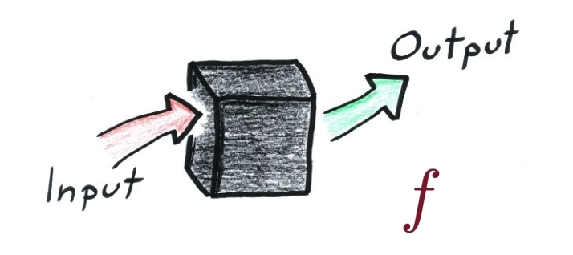
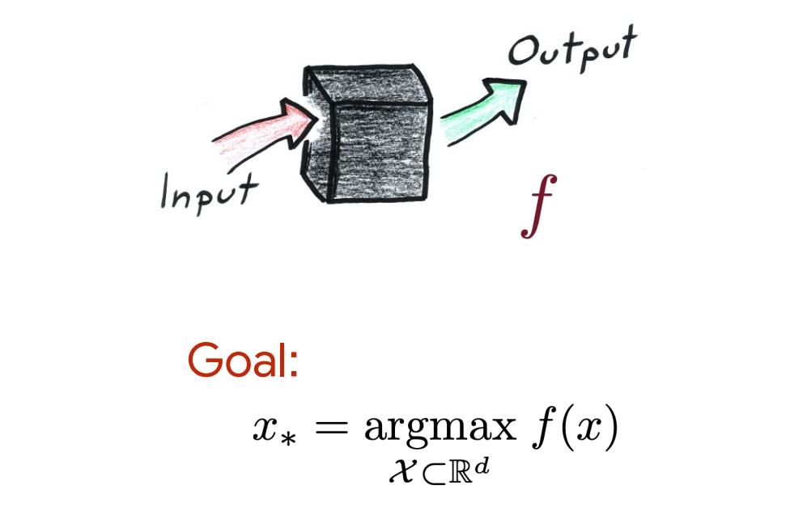
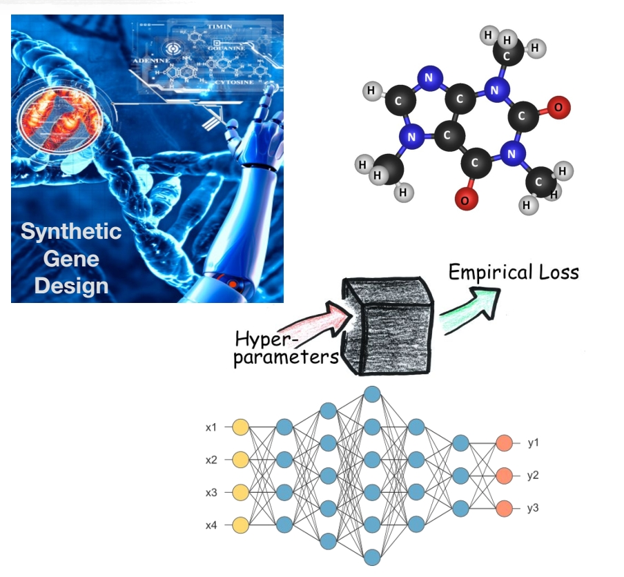
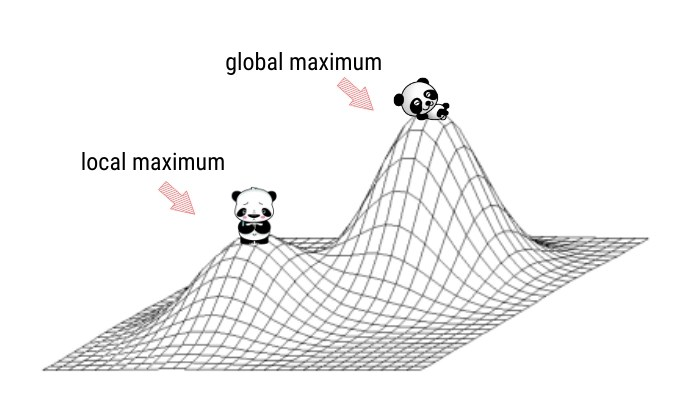
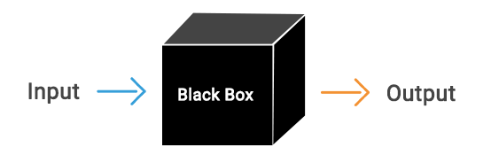
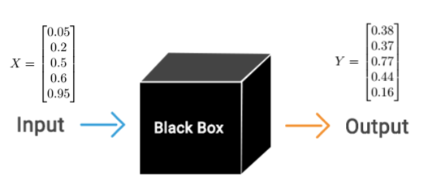
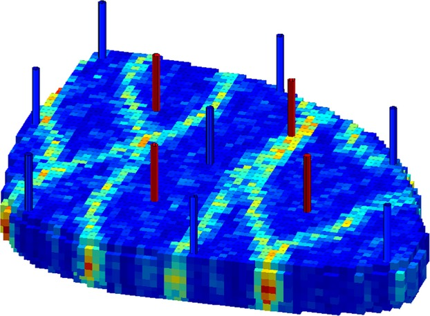
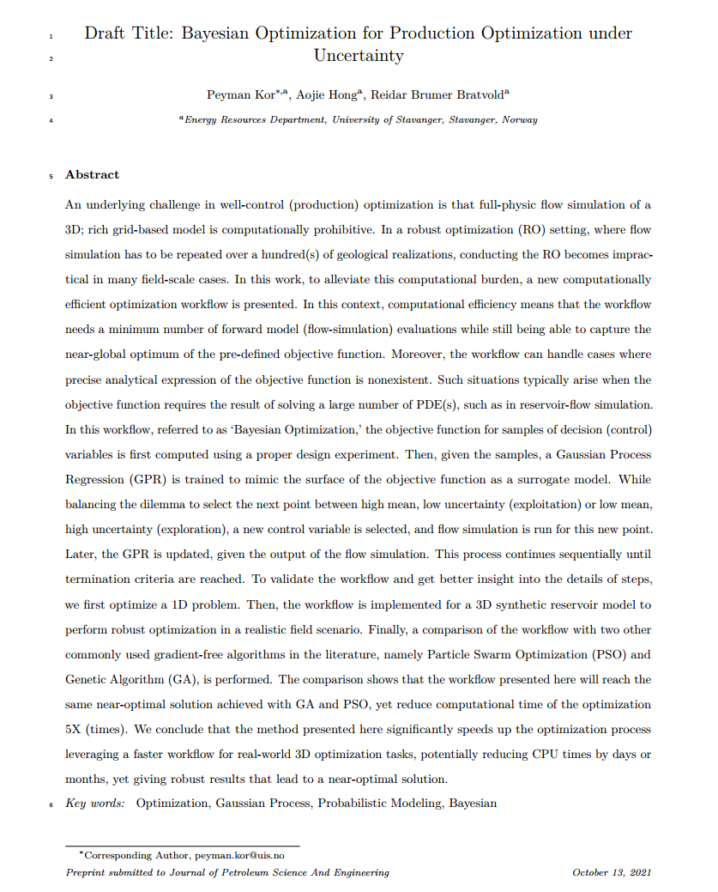

```{r setup, include=FALSE}
options(htmltools.dir.version = FALSE)
knitr::opts_chunk$set(
  fig.width=9, fig.height=3.5, fig.retina=3,
  out.width = "100%",
  cache = TRUE,
  echo = FALSE,
  message = FALSE, 
  warning = FALSE,
  hiline = TRUE,
  cache = TRUE
)
```

```{r xaringan-tile-view, echo=FALSE}
xaringanExtra::use_tile_view()
```

```{r xaringan-themer, include=FALSE, warning=FALSE}
library(xaringanthemer)
library(knitr)
library(xaringancolor)
style_duo_accent(
  primary_color = "#1381B0",
  secondary_color = "#FF961C",
  inverse_header_color = "#FFFFFF"
)
```

---
class: center, middle

# Who is this guy?
---

name: bsc
class: top, top

## Introduction: Peyman Kor
.left-column[

```{r, echo=FALSE, out.width="600px", fig.align="center", out.height= "400px"}

```

]
--
.right-column[

 #### `r emo::ji("Iran")` B.Sc in Petroleum Engineering , Petroleum University of Technology (2011-2016)

  <!-- - B.Sc Thesis: Asphaletene Deposition Modeling along Wellbore -->

{{content}}
]
--
 #### `r emo::ji("Norway")` M.Sc in Reservoir Engineering, University of Stavanger (2017-2019)
 
```{r, echo=FALSE, out.width="400px", fig.align="center", out.height= "200px"}

```
```{r, echo=FALSE, out.width="600px", fig.align="center", out.height= "300px", include=FALSE}

```
 
 <!-- - Bayesian Neural Network for Probabilistic Forecasting -->

{{content}}
--

#### `r emo::ji("Denmark")` M.Sc in Applied Mathematics and Computation, Technical University of Denmark (2019 - 2020)


---
name: msc
class: top, top
exclude: true
count: false

## Introduction: Peyman Kor
.left-column[

```{r, echo=FALSE, out.width="600px", fig.align="center", out.height= "400px"}

```

]
--
.right-column[
 * `r emo::ji("Norway")` M.Sc in Reservoir Engineering, University of Stavanger (2017-2019)

```{r, echo=FALSE, out.width="400px", fig.align="center", out.height= "200px"}

```


{{content}}
]
--

 * `r emo::ji("Denmark")` M.Sc in Applied Mathematics and Computation, Technical University of Denmark (2019 - 2020)

```{r, echo=FALSE, out.width="400px", fig.align="center", out.height= "150px"}

```

{{content}}
--

---
name: phd
class: top, top

## Introduction: Peyman Kor
.left-column[

```{r, echo=FALSE, out.width="600px", fig.align="center", out.height= "400px"}

```

]
--
.right-column[

 #### `r emo::ji("Norway")` Ph.D. Student in Computational Engineering, University of Stavanger, Dec 2020 - Ongoing

  - Decision Analysis, Optimization, and Reinforcement Learning.
  - Supervisors: Reidar B. Bratvold and Aojie Hong

{{content}}
]
--

- Decision and Data Analytics (DDA) Research Group at the University of Stavanger

```{r, echo=FALSE, out.width="50%", fig.align="center"}

```


{{content}}
--

---

class: center, middle

# Black-Box Function Optimization?

---

## What is Black-box Function?

--

.pull-left[

### White-box function

```{r, echo=FALSE, fig.align='left', out.width="70%", fig.align='center'}
knitr::include_graphics("img/white_box.png")
```

]
--
.pull-right[

### Black-box function

```{r, echo=FALSE, fig.align='left', out.width="100%"}

```


]
---
class: Left
## Black-box Function Optimization

--

```{r, echo=FALSE, out.width="75%", fig.align='center'}

```


---
## Black-box Function Optimization

--
.pull-left[

```{r, echo=FALSE, fig.align='left', out.width="80%"}

```

]
--

.pull-right[

### Output of Reservoir Simulation 

```{r, echo=FALSE, fig.align='center', out.width="900px", out.height="400px"}
knitr::include_graphics("img/egg.gif")
```

]
---

class: center, middle

# Why Black-box Function Optimization is difficult?

--

## Three main reasons: A, B, C

---

class: Left
## Why Black-box Function Optimization is difficult? (A)

--
.pull-left[

```{r, echo=FALSE, out.width="100%", fig.align='center'}

```


]
--
.pull-right[
### A) No grdaient information! 

```{r, echo=FALSE, out.width="80%", fig.align='center'}
include_graphics("img/derivative.gif")
```

]

---
class: Left
## Why Black-box Function Optimization is difficult? (B)

--
.pull-left[

```{r, echo=FALSE, out.width="100%", fig.align='center'}

```


]
--
.pull-right[
### B) $f(x)$ is multi-peak! 

```{r, echo=FALSE, out.width="100%", fig.align='center'}

```

]

---
## Why Black-box Function Optimization is difficult? (C)

--
.pull-left[

```{r, echo=FALSE, out.width="100%", fig.align='center'}

```


]
--
.pull-right[

### B) forward evaluation of $f(x)$ is time-consuming! 

```{r, echo=FALSE, out.width="100%", fig.align='center'}

```

]

---
class: Left
## Why Black-box Function Optimization is difficult? (C)

.pull-left[

- Each forward evaluation of the experiments takes around $\sim 1 \text{month}$

```{r, echo=FALSE, out.width="400px",out.height="300px",fig.align="center"}

```

]

--
.pull-right[

 - Say the biochemical engineering team of company has identified 4 main process parameters.
 
 - 1)Temperature, 2)pH, 3)Co2 Concentration, 4)Harvest Time


{{content}}
]
--

- According to them, each of the process parameters can take 5 different value.

- Then total possible combinations are $5^4=625$

{{content}}

--
- Then total time to evaluate all possible combination of solution is $$5^4\times \text{month}=625\times \text{month}\sim \color{red}{52 \: \text{years}!}$$

{{content}}


--
---

class: center, middle

### We need an optimization method that can handle all three difficulties! 

--

## Bayesian Optimization

--

### Well-suited method for global optimization of black-box functions.

---
## Example of Bayesian Optimization:

--

```{r, echo=FALSE, out.width="80%", fig.align='center'}

```

--

### Question: What is the input that maximizes the output? 

---
## Example of Bayesian Optimization:

--

### Step I) Initialization:

--

```{r, echo=FALSE, out.width="80%", fig.align='center'}

```

---
## Example of Bayesian Optimization:

### Step I) Plot of Initialization:

--

```{r loadlibraries, message=FALSE, echo=FALSE, error=FALSE}

one_d_fun <- function(x) {
  y <- (1-1/2*((sin(12*x)/(1+x))+(2*cos(7*x)*x^5)+0.7))
  return(y)
}

xmin <- optimize(one_d_fun, c(0, 1), tol = 0.0001, maximum = TRUE)

library(DiceKriging)
library(mvtnorm)
library(tidyverse)

library(tibble)
library(kableExtra)

library(tidyverse)
library(latex2exp)

library(patchwork)
library(gridExtra)
library(tidyverse)

library(ParBayesianOptimization)

```

```{r onedplot, echo=FALSE, fig.retina=2, fig.align='center', fig.width= 16, fig.height= 7, warning=FALSE, include=FALSE}

x_domain <- seq(0,1,0.01)
y_domain <- one_d_fun(x_domain)

data_domain <- tibble(x=x_domain, y= y_domain)

df_text <- data.frame(
  x = 0.39,
  y = 0,
  text = c("bottom-left")
)
ggplot(data_domain, aes(x,y)) +
  geom_point() +
  geom_vline(xintercept = 0.390, linetype="dotted",
                color = "blue", size=1.5) +
   annotate("text", x=0.32, y=0, label= "x_M", hjust = 0, vjust=+1 ,colour = "blue") +
  ylim(0,1.04) +
  ylab("f(x)")

```

```{r echo=FALSE, message=FALSE}
set.seed(123)
# ######################################################
# one_d_fun <- function(x) {
#   y <- (1-1/2*((sin(12*x)/(1+x))+(2*cos(7*x)*x^5)+0.7))
#   return(y)
# }
# #################################################
# 
# xmin <- optimize(one_d_fun, c(0, 1), tol = 0.0001, maximum = TRUE)
#########################################################

x_domain <- seq(0,1,0.01)
y_domain <- one_d_fun(x_domain)
#y_domain <- max(y_domain) - min(y_domain)
data_domain <- tibble(x=x_domain, y= y_domain)
#data_domain

#r <- max(vec) - min(vec)
#vec <- (vec - min(vec))/r
#########################################################
obs_data_return <- function(x) {
  y_norm <- one_d_fun(x)
  #y_norm = y-mean(y)
  df <- data.frame(x,y_norm)
}
#################################

km_model <- function(obs_data, predict_x) {
  
  model <- km(~0, design = data.frame(x=obs_data$x), response = obs_data$y_norm, multistart = 100, 
              control =list(trace=FALSE))
  paste0(model@covariance@range.val)
  p.SK <- predict(model, newdata=data.frame(x=predict_x), type="SK",cov.compute = TRUE)
  return(list(predict_list=p.SK,cov_par=model@covariance@range.val))
}

###################################

plot_post <- function(predict_list,x_predict,obs_data) {
  
  mv_sample <- mvtnorm::rmvnorm(100, predict_list$mean, predict_list$cov)
  ss <- t(mv_sample)
  
  dat <-data.frame(x=x_predict, ss) %>% 
    pivot_longer(-x, names_to = "rep", values_to = "value") %>% 
    mutate(rep=as.numeric(as.factor(rep)))
  
  data_gp <- data.frame(x=x_predict,upper95=predict_list$upper95,
                        lower95=predict_list$lower95, mean_curve=predict_list$mean)
  
  
  ggplot(dat,aes(x=x,y=value)) + 
    geom_line(aes(group=as.factor(rep), color="blue"), alpha=0.7) +
    #scale_colour_manual("",values = cols) +
    scale_color_manual("", values = c("blue", "red"), 
                       labels=c("Sample from the posterior","Mean Value")) +#REPLICATES +
    geom_ribbon(data = data_gp, 
                aes(x, 
                    y = mean_curve, 
                    ymin = lower95, 
                    ymax = upper95,
                    fill="grey"), alpha = 0.6, show.legend = T) +
    scale_fill_manual("",values="gray", labels="95% CI") +
    geom_line(dat = data_gp, aes(x=x,y=mean_curve, color="red"), size=1) + #MEAN
    geom_point(data=obs_data,aes(x=x,y=y_norm),fill="green", color="yellow",shape=23, size=2) +
    #geom_line(data=data_domain,aes(x=x_domain,y=y_domain, color="black"),size=1, alpha=0.7) +
    scale_y_continuous(lim=c(-0.5,1.2)) +
    scale_x_continuous(lim=c(0,1)) +
    theme(legend.position="none") +
    theme(legend.text=element_text(size=4)) +
    theme(text = element_text(size=6)) +
    theme(axis.title.x = element_blank(),
          axis.title.y = element_blank())
    #theme(legend.position="top")
  
}

##################################################################

utility_cal <- function(predict_list, x_predict,obs_data,eps) {
 
  y_max <- max(obs_data$y_norm)
  
  z <- (predict_list$mean - y_max - eps) / (predict_list$sd)
  
  utility <- (predict_list$mean - y_max - eps) * pnorm(z) + (predict_list$sd) * dnorm(z)
  
  new_x <- x_predict[which(utility==max(utility))] 
  
  return(new_x)
}

########################################################################


utility_cal_plot <- function(predict_list, x_predict,obs_data,eps,x_next) {
  
  y_max <- max(obs_data$y_norm)
  z <- (predict_list$mean - y_max - eps) / (predict_list$sd)
  
  utility <- (predict_list$mean - y_max - eps) * pnorm(z) + (predict_list$sd) * dnorm(z)
  
  data_utility <- data.frame(x=x_predict, utility=utility)
  
  ggplot(data_utility,aes(x,utility)) +
    geom_line() +
    scale_y_continuous(position = "right") +
    theme(text = element_text(size=6)) +
    geom_vline(xintercept = x_next, linetype="dotted", 
                color = "blue", size=0.5) +
   annotate("text", x=x_next, y=0, label= "x_next", hjust = -0.5, vjust=-2 ,colour = "blue") +
    theme(axis.title.x = element_blank(),
          axis.title.y = element_blank())
}

###############################################


plot_post_indi <- function(predict_list,x_predict,obs_data) {
  
  
  mv_sample <- mvtnorm::rmvnorm(100, predict_list$mean, predict_list$cov)
  ss <- t(mv_sample)
  
  dat <-data.frame(x=x_predict, ss) %>% 
    pivot_longer(-x, names_to = "rep", values_to = "value") %>% 
    mutate(rep=as.numeric(as.factor(rep)))
  
  data_gp <- data.frame(x=x_predict,upper95=predict_list$upper95,
                        lower95=predict_list$lower95, mean_curve=predict_list$mean)
  
  
  ggplot(dat,aes(x=x,y=value)) + 
    geom_line(aes(group=as.factor(rep), color="blue"), alpha=0.7) +
    #scale_colour_manual("",values = cols) +
    scale_color_manual("", values = c("blue", "red"), 
                       labels=c("Sample from the posterior","Mean Value")) +#REPLICATES +
    geom_ribbon(data = data_gp, 
                aes(x, 
                    y = mean_curve, 
                    ymin = lower95, 
                    ymax = upper95,
                    fill="grey"), alpha = 0.6, show.legend = T) +
    scale_fill_manual("",values="gray", labels="95% CI") +
    geom_line(dat = data_gp, aes(x=x,y=mean_curve, color="red"), size=1) + #MEAN
    geom_point(data=obs_data,aes(x=x,y=y_norm),fill="green", color="yellow",shape=23, size=4) +
    #geom_line(data=data_domain,aes(x=x_domain,y=y_domain, color="black"),size=1, alpha=0.7) +
    scale_y_continuous(lim=c(-0.5,1.25)) +
    scale_x_continuous(lim=c(0,1)) +
    xlab("x") +
    ylab("y") +
    theme(text = element_text(size=20)) +
    theme(legend.position="top") 
  
}

utility_cal_plot_ind <- function(predict_list, x_predict,obs_data,eps,x_next) {
  
  y_max <- max(obs_data$y_norm)
  z <- (predict_list$mean - y_max - eps) / (predict_list$sd)
  
  utility <- (predict_list$mean - y_max - eps) * pnorm(z) + (predict_list$sd) * dnorm(z)
  
  data_utility <- data.frame(x=x_predict, utility=utility)
  
  ggplot(data_utility,aes(x,utility)) +
    geom_line() +
    geom_vline(xintercept = x_next, linetype="dotted", 
                color = "blue", size=1) +
   annotate("text", x=x_next, y=0, label= "x_next", hjust = 1.2, vjust=-1 ,colour = "blue") 
   
}

```


```{r, fig.retina=2, warning=FALSE, fig.align='left', echo=FALSE, fig.align='center', fig.width= 16, fig.height= 6}
set.seed(123)
x <- c(0.05,0.2,0.5,0.6,0.95)
obs_data_ini <- obs_data_return(x)
x_predict <- seq(0,1,0.005)
ggplot(data=obs_data_ini) +
  geom_point(aes(x=x,y=y_norm),fill="green", color="yellow",shape=23, size=10) +
   scale_y_continuous(lim=c(-0.5,1.25)) +
    scale_x_continuous(lim=c(0,1)) +
    xlab("x") +
    ylab("y")+
  theme(text = element_text(size=20))
  #theme(axis.title=element_text(size=14,face="bold"))
```

---

## Example of Bayesian Optimization:

### Step II) Build a probabilistic machine learning model

--

$$X = \begin{bmatrix}
0.05 \\
0.2 \\
0.5 \\
0.6 \\
0.95
\end{bmatrix}, Y = \begin{bmatrix}
0.38 \\
0.37 \\
0.77 \\
0.44 \\
0.16 \\
\end{bmatrix}$$

--

- We use **Gaussian Process Regression** as a Machine Learning model.

--

- Gaussian Process Regression : Gives the **Mean** of this probability distribution at each test data $x^*$.  

- Furthermore, Gaussian Process Regression gives the **Confidence Interval (CI)** at each test data $x^*$.


---

## Example of Bayesian Optimization:

### Step II) Build a probabilistic machine learning model.

--

```{r exampleshow, fig.retina=2, warning=FALSE, fig.align='left', echo=FALSE, fig.align='center', fig.width= 16, fig.height= 6}

set.seed(123)
x <- c(0.05,0.2,0.5,0.6,0.95)
obs_data <- obs_data_return(x)
x_predict <- seq(0,1,0.005)

predict_list <- km_model(obs_data,x_predict)
posterior_1 <- plot_post_indi(predict_list$predict_list,x_predict,obs_data)

new_x_point1 <- utility_cal(predict_list$predict_list,x_predict,obs_data,0.1)
utility_1 <- utility_cal_plot_ind(predict_list$predict_list,x_predict,obs_data,0.1, new_x_point1)

posterior_1 
```

---

## Example of Bayesian Optimization:

### Step III) How to find the next $x^{next}$ from the expensive function?
--


```{r exampleshow1, fig.retina=2, warning=FALSE, fig.align='left', echo=FALSE, fig.align='center', fig.width= 16, fig.height= 7}

posterior_1 + 
  geom_hline(yintercept = max(obs_data$y_norm), size=2) +
  annotate("rect", xmin = -Inf, xmax = Inf, ymin = -Inf, ymax = max(obs_data$y_norm), fill = "black", alpha = 0.7, color = NA)
#geom_hline(yintercept = max(obs_data$y_norm) )
#max(obs_data$y_norm)
```

---

## Example of Bayesian Optimization:
### Step III) How to find the $x^{next}$ from the expensive function?

```{r, fig.retina=2, warning=FALSE, fig.align='left', echo=FALSE, fig.align='center', fig.height=4}
posterior_1_ano <- posterior_1 + theme(text = element_text(size=10)) + annotate("rect", xmin = -Inf, xmax = Inf, ymin = -Inf, ymax = max(obs_data$y_norm), fill = "black", alpha = 0.7, color = NA) 

posterior_1_ano /
  utility_1
```

---

## Example of Bayesian Optimization: (Three Iterations)


--
```{r allinone, echo=FALSE, fig.align='left', fig.retina=2, message=FALSE, warning=FALSE,fig.width= 16, fig.height= 8}
set.seed(123)

x <- c(0.05,0.2,0.5,0.6,0.95)
obs_data <- obs_data_return(x)
x_predict <- seq(0,1,0.005)

predict_list <- km_model(obs_data,x_predict)
posterior_1 <- plot_post(predict_list$predict_list,x_predict,obs_data)

new_x_point1 <- utility_cal(predict_list$predict_list,x_predict,obs_data,0.1)
utility_1 <- utility_cal_plot(predict_list$predict_list,x_predict,obs_data,0.1, new_x_point1)
#utility_1
#################

x2 <- c(0.05,0.2,0.5,0.6,0.95,new_x_point1)
obs_data2 <- obs_data_return(x2)
x_predict <- seq(0,1,0.005)

predict_list2 <- km_model(obs_data2,x_predict)
posterior_2 <- plot_post(predict_list2$predict_list,x_predict,obs_data2)
new_x_point2 <- utility_cal(predict_list2$predict_list,x_predict,obs_data2,0.1)
utility_2 <- utility_cal_plot(predict_list2$predict_list,x_predict,obs_data2,0.1, new_x_point2)

###################

x3 <- c(0.05,0.2,0.5,0.6,0.95,new_x_point1,new_x_point2)
obs_data3 <- obs_data_return(x3)
x_predict <- seq(0,1,0.005)

predict_list3 <- km_model(obs_data3,x_predict)
posterior_3 <- plot_post(predict_list3$predict_list,x_predict,obs_data3)

new_x_point3 <- utility_cal(predict_list3$predict_list,x_predict,obs_data3,0.1)
utility_3 <- utility_cal_plot(predict_list3$predict_list,x_predict,obs_data3,0.1, new_x_point3)

##################

# (posterior_1 + utility_1) / 
# (posterior_2 + utility_2) / 
# (posterior_3 + utility_3) 
  #plot_layout(ncol = 2)


library(gridExtra)
grid.arrange(posterior_1, utility_1, posterior_2, utility_2, posterior_3, utility_3, ncol=2,
             widths = c(6, 4))  
# (posterior_3 + utility_3) , ncol=2)

# (posterior_1 + theme(plot.margin = unit(c(0,30,0,0), "pt"))) +
# (utility_1 + theme(plot.margin = unit(c(0,0,0,30), "pt")))
# p1 + p2 + p3 + p4 + 
#   plot_layout(ncol = 3)
```

---

## Final Solution of Bayesian Optimization (I): 

--

- The **True function** was: 

--

- $y=1-\frac{1}{2} \left(\frac{\sin (12\mathbf{x})}{1+\mathbf{x}} + 2\cos(7\mathbf{x})\mathbf{x}^5 + 0.7 \right)$

--

- The global optima of the function is $x_M=0.39$

--

- After just two iterations, Bayesian Optimization solution is: $0.385$ 

--

- Therefore, after two iteration, we are around $\frac{0.385}{0.390}=98\%$

--

- Total number of function function has been evaluated is $size(D) + size(total iteration) = 5 + 2 = 7$.
---

## Final Solution of Bayesian Optimization (II)

```{r single_with_true, echo=FALSE, fig.align='left', fig.retina=2, message=FALSE, warning=FALSE,fig.width= 16, fig.height= 8}
plot_post_indi_with_true <- function(predict_list,x_predict,obs_data) {
  
  
  mv_sample <- mvtnorm::rmvnorm(100, predict_list$mean, predict_list$cov)
  ss <- t(mv_sample)
  
  dat <-data.frame(x=x_predict, ss) %>% 
    pivot_longer(-x, names_to = "rep", values_to = "value") %>% 
    mutate(rep=as.numeric(as.factor(rep)))
  
  data_gp <- data.frame(x=x_predict,upper95=predict_list$upper95,
                        lower95=predict_list$lower95, mean_curve=predict_list$mean)
  
  
  ggplot(dat,aes(x=x,y=value)) + 
    geom_line(aes(group=as.factor(rep), color="blue"), alpha=0.7) +
    #scale_colour_manual("",values = cols) +
    scale_color_manual("", values = c("black","blue", "red"), 
                       labels=c("True Function","Sample from the posterior","Mean Value")) +#REPLICATES +
    geom_ribbon(data = data_gp, 
                aes(x, 
                    y = mean_curve, 
                    ymin = lower95, 
                    ymax = upper95,
                    fill="grey"), alpha = 0.6, show.legend = T) +
    scale_fill_manual("",values="gray", labels="95% CI") +
    geom_line(dat = data_gp, aes(x=x,y=mean_curve, color="red"), size=1) + #MEAN
    geom_point(data=obs_data,aes(x=x,y=y_norm),fill="green", color="yellow",shape=23, size=4) +
    geom_line(data=data_domain,aes(x=x_domain,y=y_domain, color="black"),size=1, alpha=0.7) +
    scale_y_continuous(lim=c(-0.5,1.25)) +
    scale_x_continuous(lim=c(0,1)) +
    xlab("x") +
    ylab("y") +
    theme(text = element_text(size=20)) +
    theme(legend.position="top") 
  
}

utility_cal_plot_ind <- function(predict_list, x_predict,obs_data,eps,x_next) {
  
  y_max <- max(obs_data$y_norm)
  z <- (predict_list$mean - y_max - eps) / (predict_list$sd)
  
  utility <- (predict_list$mean - y_max - eps) * pnorm(z) + (predict_list$sd) * dnorm(z)
  
  data_utility <- data.frame(x=x_predict, utility=utility)
  
  ggplot(data_utility,aes(x,utility)) +
    geom_line() +
    geom_vline(xintercept = x_next, linetype="dotted", 
                color = "blue", size=1) +
   annotate("text", x=x_next, y=0, label= "x_next", hjust = 1.2, vjust=-1 ,colour = "blue") 
   
}

x3 <- c(0.05,0.2,0.5,0.6,0.95,new_x_point1,new_x_point2)
obs_data3 <- obs_data_return(x3)
x_predict <- seq(0,1,0.005)

predict_list3 <- km_model(obs_data3,x_predict)
posterior_3 <- plot_post_indi_with_true(predict_list3$predict_list,x_predict,obs_data3)

#new_x_point3 <- utility_cal(predict_list3$predict_list,x_predict,obs_data3,0.1)
#utility_3 <- utility_cal_plot(predict_list3$predict_list,x_predict,obs_data3,0.1, new_x_point3)
posterior_3
```


---
class: center, middle

# Application of Bayesian Optimization for Management of Water flooding in Reservoir


---
class: Left

## Problem Definition:
### What are optimum wtaer injection rate for eight injection wells?

--
.pull-left[

```{r eggbase, echo=FALSE, fig.align='center', out.width="800px", fig.retina=2, cache=TRUE}

```

]
--
.pull-right[

```{r, echo=FALSE, fig.align='center', out.width="900px", out.height="400px"}
knitr::include_graphics("img/egg.gif")
```
]

---

## Improvemnet in profit compared to Base-case?  

--

.pull-left[

- #### Base Case:


```{r basecase-inj, echo=FALSE, fig.align='left', fig.retina=2, message=FALSE, warning=FALSE,,fig.asp= 0.7}
base_case_rate <- rep(60,8)
inj_well <- c("Inj1","Inj2","Inj3","Inj4","Inj5","Inj6","Inj7","Inj8")
base_case_df <- tibble(inj_well, base_case_rate)
colnames(base_case_df) <- c("inj", "Injection_Rate")

base_case_df$case <- "Base_case"
p0 <- ggplot(data=base_case_df, aes(x=inj, y=Injection_Rate)) +
geom_bar(width = 0.4, stat="identity", position=position_dodge(), fill="blue",color = 'black') +
  coord_cartesian(ylim = c(5, 100)) +
  labs(y = TeX("Injection Rate, $m^3/D$")) +
  theme(text = element_text(size=20))

p0
```

- Objective Function: Net Present Value (NPV)=
 $$\color{blue}{\sim 34.5 \: \text{MM USD}}$$ 
]

--

.pull-right[

- #### Optimum Case:

```{r opt-inj, echo=FALSE, fig.align='center', fig.retina=2, message=FALSE, warning=FALSE, fig.asp= 0.7}
library(ParBayesianOptimization)

#bo_12345 <- readRDS("processed_data/bo_12345_401000.Rds")
#
bo_1234 <- readRDS("processed_data/bo_1234_401000.Rds")
#
#bo_123 <- readRDS("processed_data/bo_123_401000.Rds")

u_best_1234 <- getBestPars(bo_1234)

opt_df <- as.tibble(u_best_1234) %>% pivot_longer(everything(),names_to = "inj", values_to = "Injection_Rate")

opt_df$inj <- c("Inj1","Inj2","Inj3","Inj4","Inj5","Inj6","Inj7","Inj8")
opt_df$case <- "Opt_case"


full_df <- rbind(base_case_df,opt_df)

p1 <- ggplot(data=full_df, aes(x=inj, y=Injection_Rate, fill=case)) +
  geom_bar(width = 0.4, colour="black",stat="identity", position=position_dodge()) +
  coord_cartesian(ylim = c(5, 100)) +
  scale_fill_manual(values=c("blue","red")) +
  labs(y = TeX("Injection Rate, $m^3/D$")) +
  theme(legend.position = "top") +
  theme(text = element_text(size=20))
p1
###########

```

- Objective Function: Net Present Value (NPV)=
 $$\color{red}{\sim 36.8 \: \text{MM USD}}$$
]
---
class: center, middle

# Big Tech Company working on Bayesian Optimization?

---
## Facebook:

--
```{r fblogo, echo=FALSE, fig.align='left', out.width="100px", fig.asp=0.8, fig.retina=2, cache=TRUE}
knitr::include_graphics("img/fb_logo.png")
```

--
.pull-left[

#### Python Package:
```{r fbpaper, echo=FALSE, fig.align='left', fig.retina=2, cache=TRUE}

```

]

--

.pull-right[
#### Research Team:
```{r fb, echo=FALSE, fig.align='center', fig.asp=0.8, fig.retina=2, cache=TRUE}

```

]

---

## More detail about Bayesian Optimization:

```{r paper, echo=FALSE, fig.align='center',out.width="600px", out.height="500px", fig.retina=2, cache=TRUE}

```

---

class: center, middle

### Thank you for your time and

--

### Thanks to SPE Stavanger Student Chapter, for Invitation!


